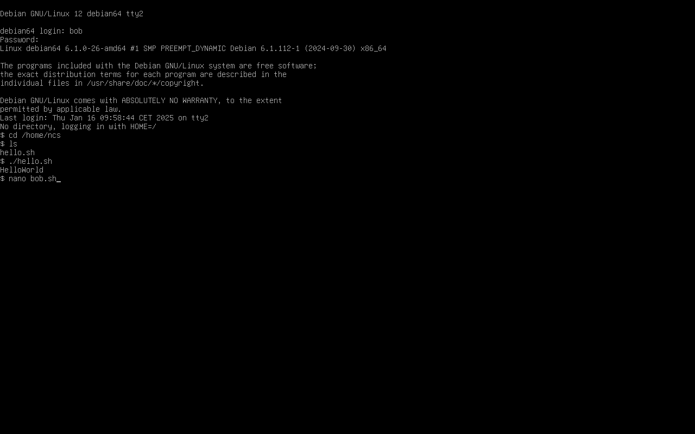
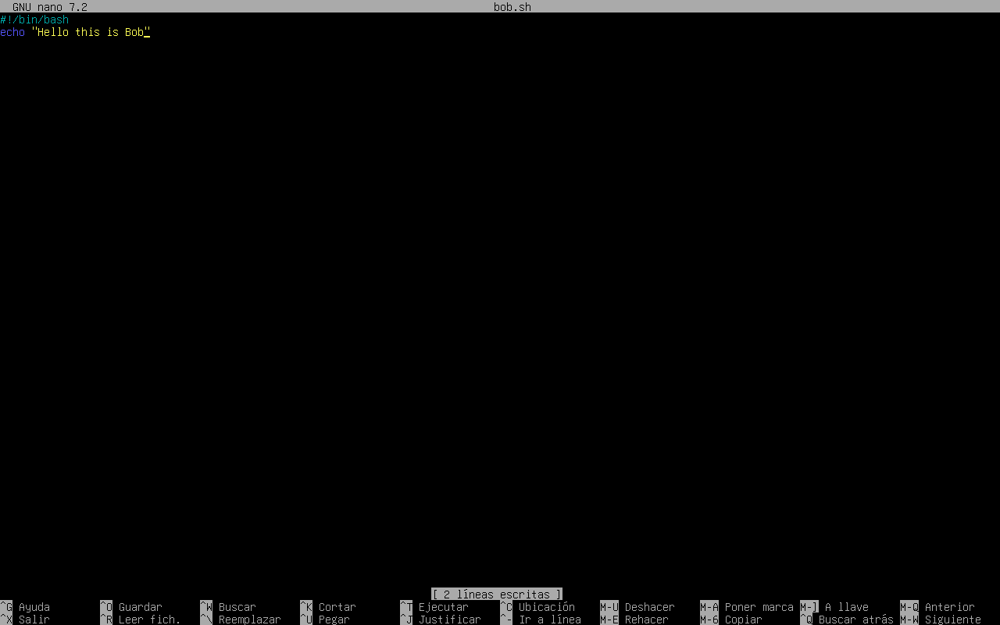
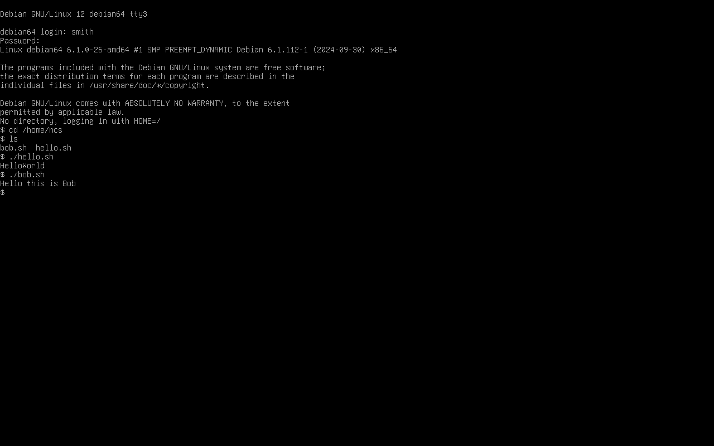

# Laboratorio 3: sistemas Linux y scripts en shell

### Act. 3.1: creando un script ejecutable en bash

#### Grabación de la actividad:

#### Explica por qué dar permisos 777 a un archivo es una mala idea.

Si le damos permisos 777 a un fichero, estamos proporcionando a todos los usuarios del sistema control completo sobre este fichero.
Esto representa un problema de seguridad especialmente grave si se trata de un fichero con contenido delicado, como puede ser un script que manipule archivos del sistema.

### Act. 3.2: creando nuevos usuarios

#### Grabación de la actividad:

### Act. 3.3: creando un script ejecutable compartido

#### Grabación de la actividad:

### Act. 3.4: accediendo a ficheros desde diferentes cuentas de usuario

He podido ejecutar el script hello.sh desde el usuario bob, ya que al archivo se le dieron permisos 755, que permite leer y ejecutar
a otros usuarios.

El script bob.sh también se ejecuta porque bob es el propietario del fichero y tiene todos los permisos sobre él.

Ambos script pueden ser ejecutados desde el usuario smith porque tienen permisos 755.