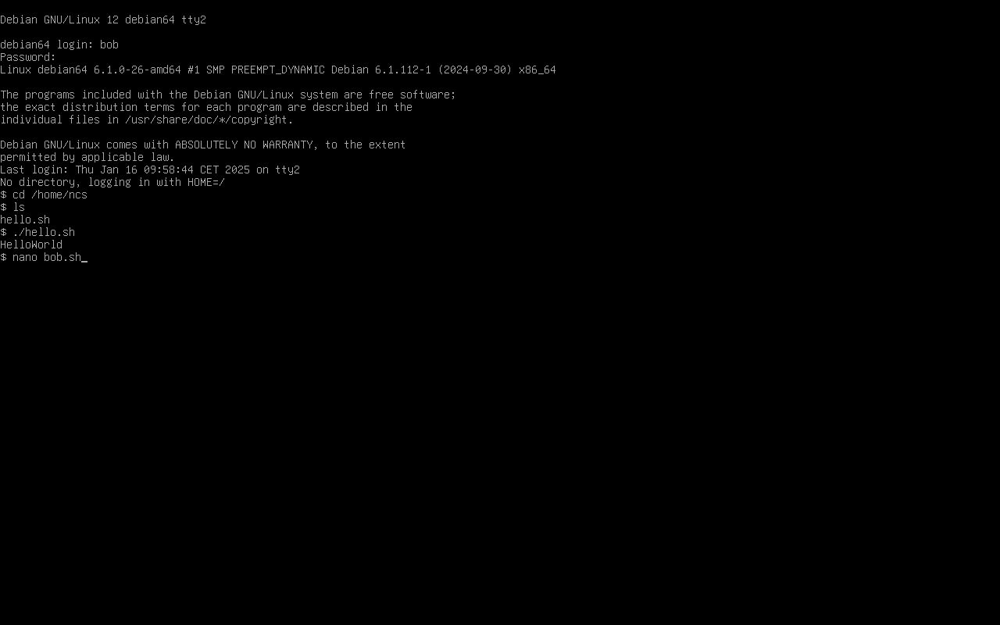

# Laboratorio 7: Apache HTTP server and PHP

### Act. 7.1: configurando Apache

#### Archivo /etc/httpd/httpd.conf

#### Las líneas que empiezan por # son comentarios: ¿para qué sirven? 

El propósito de estas líneas es proporcionar documentación y explicaciones dentro del fichero de configuración. No afectan al funcionamiento de Apache, pero ayudan a los administradores a entender la configuración.

####  Busque los valores por defecto de ServerName y DocumentRoot y anótelos. ¿Qué hacen/significan?

- ServerName define el nombre de host que Apache usa para identificarse.

- DocumentRoot especifica el directorio desde el que Apache sirve los ficheros.

#### Descomente la línea "Incluya /etc/httpd/mod_php.conf". ¿Para qué sirve? 

Esta línea carga parámetros de configuración adicionales de /etc/httpd/mod_php.conf.
Este fichero contiene normalmente parámetros para integrar PHP con Apache, como habilitar el módulo PHP y definir manejadores para ficheros .php.

### Act. 7.2: ejecutando Apache

#### Grabación de la actividad

#### ¿Por qué es necesario reiniciar httpd después de hacer cambios en la configuración?
Cuando se modifica el fichero de configuración de Apache, esos cambios no se aplican automáticamente. Apache lee su configuración sólo cuando se inicia.
Reiniciar fuerza a Apache a recargar la configuración y aplicar los cambios.

#### Pregunta acerca del comando ps aux | grep httpd
##### a) ¿Qué hace el comando ps aux? ¿Qué hace el comando grep httpd?   ¿Qué significa «|»? Por último, explique lo que hace el comando ps aux | grep httpd.
- ps aux

ps muestra el estado del proceso. El resto del comando (aux) se divide de esta forma:
a → Muestra los procesos de todos los usuarios.
u → Muestra el usuario que ejecuta cada proceso.
x → Incluye procesos no adjuntos a un terminal.
 
- grep httpd

grep se utiliza para buscar patrones de texto en la salida de comandos.
En este caso, busca cualquier línea que contenga la palabra "httpd", filtrando sólo los procesos relevantes.
 
- | (operador de tubería)

La tubería envía la salida de un comando a otro.

ps aux produce una lista de procesos, y esta salida es filtrada por grep httpd.

#####  b) ¿Qué esperaría ver como salida del comando ps aux | grep httpd si httpd está corriendo? ¿Y si no se está ejecutando? Prueba en ambos casos y anota los resultados.
- Si httpd se está ejecutando:

Podemos ver en el vídeo como se muestran múltiples líneas, una por cada proceso Apache. 

- Si httpd no se está ejecutando:

La salida sólo contiene el propio comando grep.
Lo cual significa que Apache no se está ejecutando.

#### Ejecutando ps axl | egrep «httpd|PPID», encuentre el ID de proceso del proceso httpd padre (el PPID).
Mostrado al final del vídeo.

### Act. 7.3: creando archivos HTML

#### Grabación de la actividad

#### ¿Qué tienen de especial los archivos index.htm e index.html? 
Estos archivos sirven como página de destino por defecto para un sitio web cuando un usuario accede a un directorio en un navegador web.
Si no existen ni index.html ni index.htm, el servidor es incapaz de mostrar el contenido correctamente o devuelve un error.

### Act. 7.4: visualizando archivos HTML usando una terminal

#### Grabación de la actividad

#### Explique la diferencia entre CLI y GUI
Una CLI (Command Line Interface) es una interfaz basada en texto en la que los usuarios interactúan con el sistema tecleando comandos. Es más rápida, utiliza menos recursos del sistema y es muy flexible, especialmente para la automatización.

La interfaz gráfica de usuario (GUI) ofrece un entorno visual en el que los usuarios interactúan con el ratón, el teclado y elementos gráficos como ventanas y botones. Es más fácil de usar, pero requiere más recursos del sistema y suele ser menos flexible que una CLI para la automatización.

#### ¿Qué tiene de especial la dirección IP 127.0.0.1?
127.0.0.1 se conoce como localhost, una dirección utilizada para referirse a la propia máquina.
Cualquier petición de red enviada a 127.0.0.1 nunca sale del ordenador; es gestionada internamente por el SO.
Útil para probar servidores localmente antes de desplegarlos en Internet.

### Act. 7.5: creando y visualizando archivos PHP mediante una terminal

#### Grabación de la actividad

#### ¿Qué hace phpinfo();?
La función phpinfo(); muestra información detallada acerca del entorno PHP, como por ejemplo:

- Versión de PHP
- Módulos y extensiones cargados
- Configuración del servidor (configuración de Apache)
- Información del sistema (SO, arquitectura)
- Variables PHP y configuración del entorno

### Act. 7.6: explorando y añadiendo entradas al fichero de hosts

#### Grabación de la actividad
